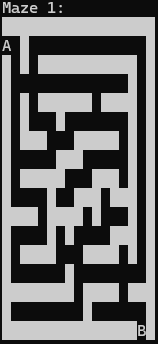
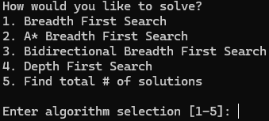
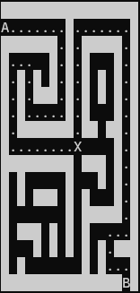

# Maze Solver

A terminal-based, cross platform maze solver written in Python. Includes a script with different maze solving algorithms and a folder of mazes represented by CSV files.

## What This Does

**Maze Solver** allows the user to select an input maze to solve with a specified algorithm all through the CLI. After the selection of a maze and algorithm, the script outputs a series of time delayed representations of each step of the chosen solution to that maze. The user can also create new CSV mazes to solve.

### Key Features

- **Breadth First Search** — Extends every path by one square each iteration and skips dead paths.
- **A\* Breadth First Search** — Extends the path with the lowest total estimated cost from the start square A to the end square B, calculated by the sum of the distance traversed and Manhattan Distance (horizontal distance + vertical distance) to B.
- **Bidirectional Breadth First Search** — Implements two instances of BFS, one from A and one from B. Iterates upon the instance with the lesser quantity of active paths to save computational cost. 
- **Depth First Search** — Searches each available path to completion before searching the next available path.
- **Find total # of solutions** — Implements a brute force DFS approach to find every possible solution to a maze. Prints the total # of solutions to an input maze.

Each algorithm uses a random generator to randomize the solution.

## Requirements

### Supported Platforms

- Windows
- Linux
- macOS

### Dependencies

- Python 3.10+

## Installation

```bash
git clone https://github.com/amwol/Maze-Solver.git
cd Maze-Solver
```

## Usage

```bash
python mazeSolver.py
```

### Script presents mazes and prompts the user to select a maze.



### Script presents algorithms and prompts the user to select an algorithm.



### Executes algorithm and illustrates each step



## Add Mazes

To add a maze, add the file `maze<N>.csv` to `mazes/` in the same format of 0s, 1s, A and B.
